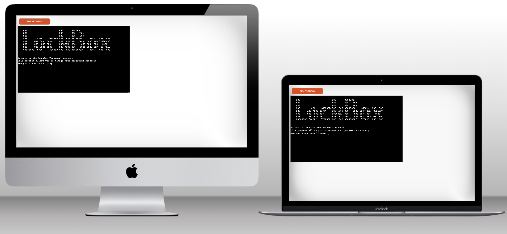
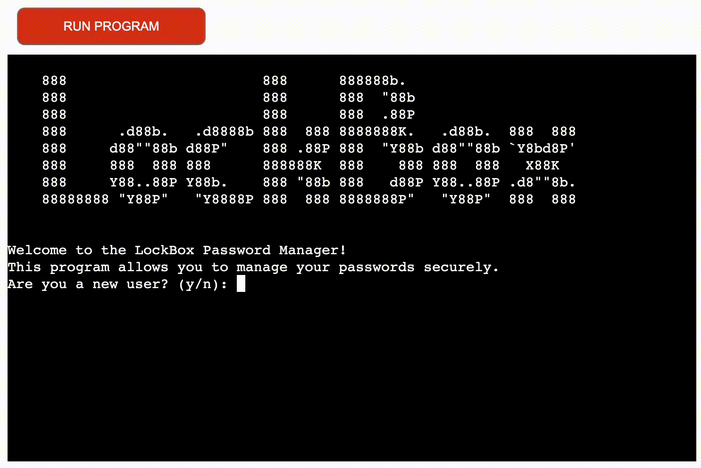
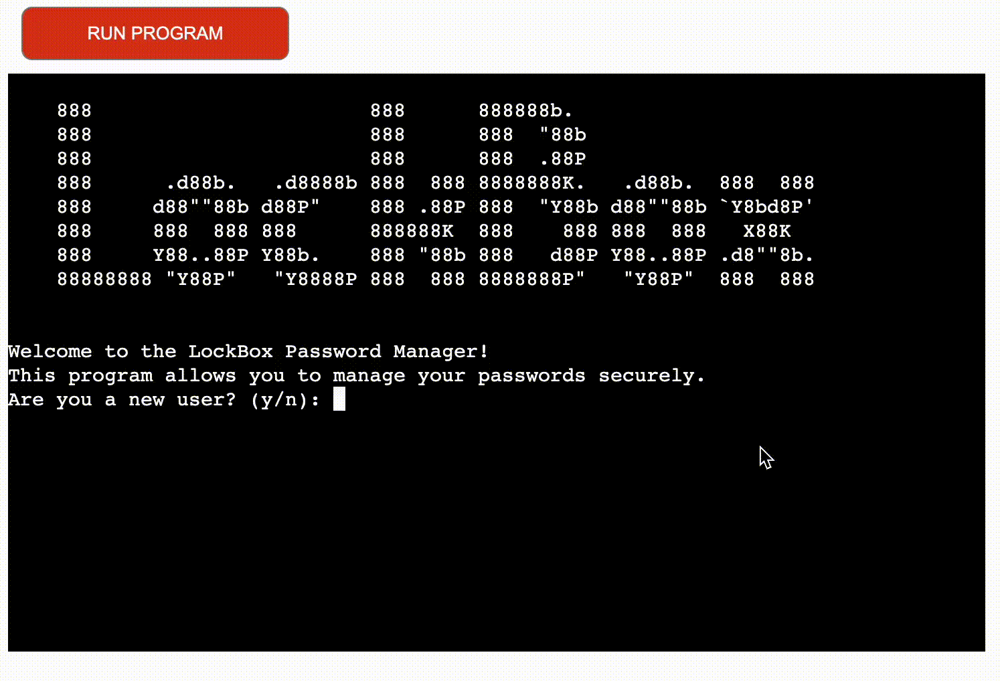
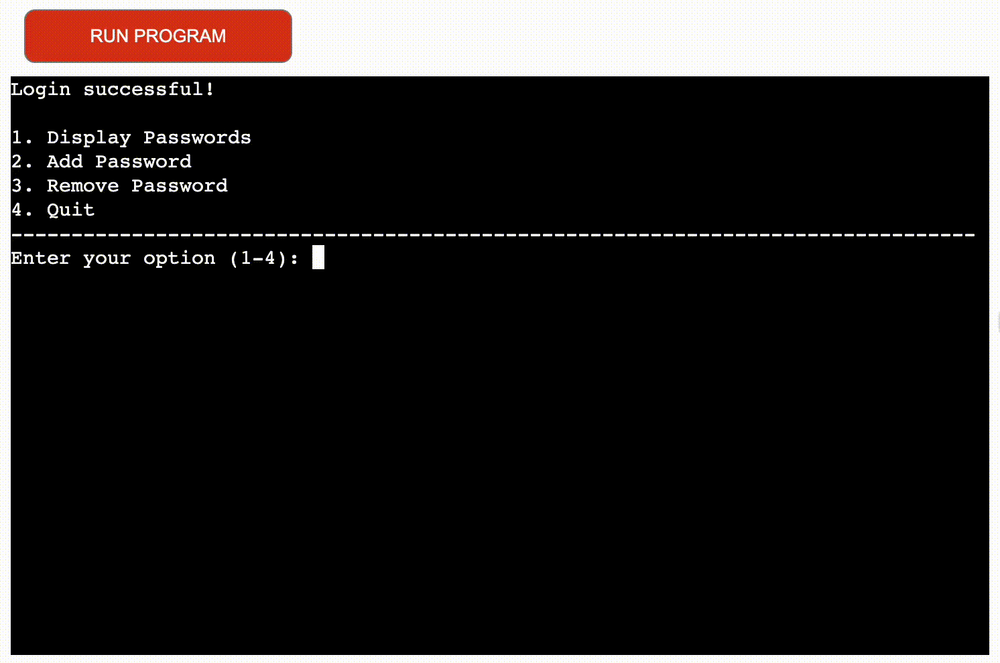
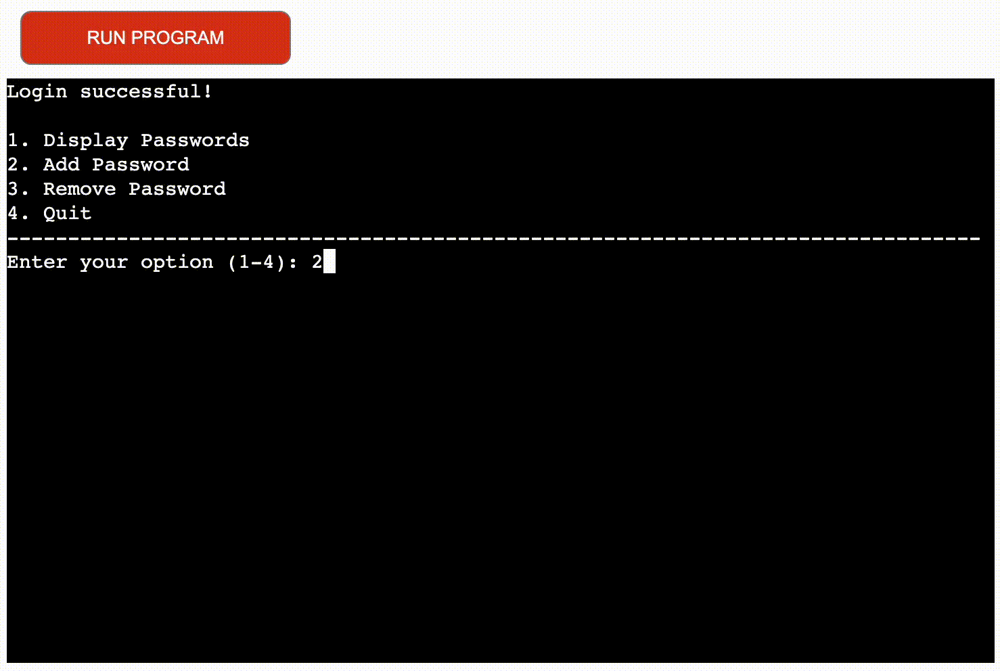
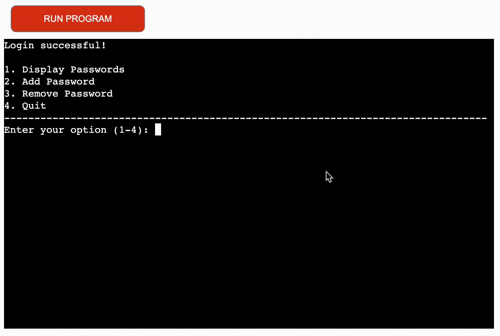
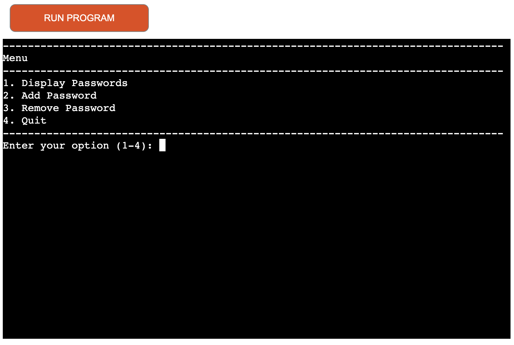

# LockBox

LockBox is an advanced password management application built to securely store and organize your sensitive information. With its user-friendly command-line interface, LockBox ensures convenient access to your passwords while employing robust encryption algorithms to safeguard your data from unauthorized access. The application allows you to generate strong and unique passwords, eliminating the need to remember complex combinations. By adhering to best security practices, LockBox provides a secure environment for managing your passwords, ensuring the protection of your online accounts. Experience the convenience and peace of mind that LockBox brings, offering a reliable and efficient solution for your password management needs.

Click here to load [LockBox](https://lockbox-0538d34db4b9.herokuapp.com)

# How to use

1.  Existing User Login: If you are an existing user, you will be prompted to enter your username. After entering your username, you will be asked to provide your master password. Enter your master password without displaying the input. If the entered master password matches the stored master password, you will be logged in successfully.

2.  New User Account Creation: If you are a new user, you will be asked to create a new account. Enter your desired username and create a master password. Confirm the master password to ensure accuracy. The application will create a new account and store your master password securely.

3.  Main Menu: After logging in or creating a new account, you will be presented with the main menu. The main menu allows you to perform various actions:

    - Display Passwords (Option 1): Choose this option to display all the stored passwords associated with your account. If there are no passwords stored, a message will be displayed indicating that there are no passwords stored for your account.

    - Add Password (Option 2): Use this option to add a new password for an account. You will be prompted to enter the site or account name and choose an option to either enter the password manually or generate a random password. If you choose to enter the password manually, you need to follow the password requirements (minimum length of 4 characters and at least 1 special character). If you choose to generate a random password, you can specify the length or use the default length of 12 characters. The password will be added to your account's stored passwords.

    - Remove Password (Option 3): Select this option to remove a password from your account. You will be prompted to enter the account name associated with the password you want to remove. If the account exists in your stored passwords, it will be removed.

    - Quit (Option 4): Choose this option to exit the application. It will terminate the program and display a goodbye message.

4.  Menu Navigation: While in the main menu, you can choose the desired option by entering the corresponding number (1-4) and pressing Enter. If you enter an invalid choice, an error message will be displayed, and you can try again.

# Table Of Contents

- [How To Use](#how-to-use)
- [Target Audience](#target-audience)
  - [User Stories](#user-stories)
- [Data Model](#data-model)
  - [logic Map](#logic-map)
- [Features](#features)
  - [User Account Creation](#user-account-creation)
  - [Login and Authentication](#login-and-authentication)
  - [Display Stored Passwords](#display-stored-passwords)
  - [Add New Password](#add-new-password)
  - [Remove Password](#remove-password)
  - [Encryption and Security](#encryption-and-security)
  - [Error Handling](#error-handling)
  - [Menu-based Navigation](#menu-based-navigation)
  - [Features Left to Add](#features-left-to-add)
- [Technologies Used](#technologies-used)
- [Frameworks, Libraries and Programs Used](#frameworks-libraries-and-programs-used)
- [Testing](#testing)
  - [Validator Testing](#validator-testing)
  - [Solved Bugs](#solved-bugs)
  - [Bugs](#bugs)
  - [Testing User Stories](#testing-user-stories)
- [Full Testing](#full-testing)
  - [Create new account and login](#create-new-account-and-login)
  - [Menu navigation](#menu-navigation)
- [Deployment](#deployment)
  - [Local Development](#local-development)
- [Credits](#credits)
  - [Inspiration](#inspiration)
  - [Code](#code)

# Target Audience

## User Stories

1.  New User:

- As a new user, I want to create a secure account with a unique username and master password. I want to be guided through the process of setting up my account and master password, ensuring that my password meets the required criteria. Once my account is set up, I want to be able to add and manage my passwords easily.

2. Returning User:

- As a returning user, I want to be able to log in to my existing account using my username and master password. I expect the application to validate my credentials and provide access to my stored passwords securely. I want to be able to view and manage my passwords, including adding new passwords, removing outdated ones, and updating existing ones.

3. Frequent User:

- As a frequent user, I rely on LockBox to securely store and manage my passwords. I value its quick login, organized display of passwords, and features like adding, removing, and updating passwords. The password generator adds extra security. LockBox streamlines password management and protects my sensitive information.

# Data Model

I have used a file-based data model provides a simple and portable approach to store and manage passwords.

- User Account: Each user has a unique username associated with their account. The username is used to identify the user and retrieve their stored passwords.
- Master Password: The user sets a master password during account creation. The master password is used to secure the user's account and protect access to their stored passwords.
- Stored Passwords: For each user account, there is a file that stores the associated passwords. The passwords are stored in a key-value format, where the account name acts as the key and the corresponding password is the value.

I also used termios and tty modules to manipulate the terminal so that I could display "\*" when the user types a password.

## Logic Map

Explication:

1. The program starts by displaying the LockBox Password Manager's ASCII art and welcoming the user. This to ensure the user understands that the program has loaded and is ready to be used.

2. It asks the user if they are a new user or an existing user. This is so the system can then follow the correct logic to either create a new account or load the login function.

3. If the user is a new user (selects 'y'), the program prompts the user to enter a desired username and master password. It then creates a new account for the user by calling the create_new_account function.

4. If the user is an existing user (selects 'n'), the program prompts the user to enter their username and master password using the login function. The user gets up to two attempts to enter the correct credentials. If the user fails both attempts, the user is prompted asking if they want to create a new account and the program is restarted.

5. If the user enters the correct credentials, the program displays the main menu with the following options:

- I decided to use a menu system as this was the easiest way for a user to interact with the system using the least amount of logic.

- Display Passwords - the program reads and decrypts the user's passwords from the file and displays them.

- Add Password - the program prompts the user to enter the site name associated with the password and choose whether to enter the password manually or generate a random password.

  - If the user chooses to enter the password manually, the program prompts the user to enter the password.
  - If the user chooses to generate a random password, the program prompts the user to enter the desired length of the password (limited to a maximum of 14 characters) and generates a random password.

- Remove Password - the program prompts the user to enter the site name associated with the password they want to remove. If the account exists in the user's password list, the program asks for confirmation to remove the password. If confirmed, it removes the password from the list and updates the file with the new password list.

- Quit - the program exits, and the Password Manager terminates.

- Invalid choice - If the user selects an invalid option, the program informs the user and asks them to try again.

6. After performing any of the actions (displaying passwords, adding or removing passwords, or quitting), the program loops back to the main menu, and the user can continue using the Password Manager as desired. I did this so that the user can decide when they want to finish using the program.

# Features

## User Account Creation

- The application allows new users to create an account by providing a unique username and a master password. The master password is used to secure the account and protect access to the stored passwords.

  

## Login and Authentication

- Existing users can log in to their account by entering their username and master password. The application verifies the entered credentials to grant access to the stored passwords.

  

## Display Stored Passwords

- Once logged in, the user can view a list of their stored passwords. The application retrieves the passwords associated with the user's account and displays them, showing the account name and the corresponding password.

  

## Add New Password

- The user can add a new password to their account. They provide the account name and choose either to enter the password manually or generate a random password. If manually entered, the password is validated to meet certain criteria (e.g., minimum length and containing at least one special character). The new password is then stored securely in the user's account.

  

## Remove Password

- The user can remove a password from their account by specifying the account name. The application locates the corresponding password and removes it from the stored passwords.

  

## Encryption and Security

- The user's master password is securely stored using encryption techniques. This ensures that the master password cannot be easily accessed or compromised. Additionally, the application enforces certain password requirements and provides validation to enhance the security of stored passwords.

- I have used (import hashlib) and
  (from cryptography.fernet import Fernet) to encrypt the data.

## Error Handling

- The application handles various error scenarios gracefully, such as invalid input, incorrect passwords, non-existing accounts, and file access errors. It provides informative error messages to guide users and ensure a smooth user experience.

  

## Menu-based Navigation

- The application presents users with a menu-based navigation system. Users can choose different options from the menu to perform specific actions, such as displaying passwords, adding passwords, removing passwords, updating the master password, and quitting the application.

  

## Features Left to Add

- Password Strength Checker
  - Improve the application by adding a password strength check feature.
- Password Generator Customization
  - Expand the password generator to allow the users to customize the generated passwords to their preferences.
- Two-Factor Authentication (2FA)
  - Add support for two-factor authentication as an additional layer of security for user accounts.

# Technologies Used

Python

# Frameworks, Libraries and Programs Used

Git - For version control.

Github - To save and share files for the site.

VScode - IDE used to code the site.

[Heroku](https://heroku.com) - Site used for deployment.

Libraries:

- Random - Used to generate random numbers and selections, specifically for creating random passwords.
- String - Provides sets of ASCII characters, like letters, digits, and punctuation, used in generating random passwords.
- os - Interacts with the operating system, mainly used for file system operations, such as creating directories and managing file paths.
- sys - Provides access to Python runtime environment variables and functions, mainly used to handle standard input and output.
- tty - Used to handle terminal settings, specifically to disable terminal echoing when entering passwords.
- termios - Used to control terminal input/output attributes, specifically setting the terminal to raw mode for secure password input.
- Hashlib - Provides various hash functions, used in this code to hash passwords securely before storing them.
- Cryptography.fernet - Used for secure encryption and decryption, specifically for encrypting and decrypting user passwords in the password manager.

[Cloud Convert](https://cloudconvert.com) - Converting videos to gif.

[Techsini](https://techsini.com) - For generating mockups.

[Loom](https://www.loom.com) - For screen recording.

[Tables Generator](https://www.tablesgenerator.com) - Used to generate tables for README file.

[Lucidchart](https://lucid.app) - Used for logic map.

# Testing

## Validator Testing

- Python
  - No errors or warnings where returned when using the [Pep8ci Validator](https://pep8ci.herokuapp.com/#)

There are messages explaining the line breaks for long lines "E128 continuation line under-indented for visual"

## Solved Bugs

1.  When an exiting user logged in and tried to display their passwords, and error would occur "cryptography.fernet.InvalidToken" . The issue was with the decryption process of the stored passwords. Specifically encrypted data had an invalid signature.

    - To solve the issue I added error handling for exceptions raised during encryption, decryption, and file operations.

 

2.  Then when running the program again and selection the option to display passwords the user received the following error "Invalid password data. Failed to decrypt."

    - To solve this new issue I realized I had not added a function to generate an encryption key, once I added this and made sure that the encryption key was generated and used consistently, the program displayed the user passwords correctly.

 

3.  I was receiving an error when creating a new account and master password. This because I had forgotten to add the new key perimeter to multiple functions cause an error when running the program.

    - To fix this I added the necessary key perimeter to the functions that where missing this.

 

4.  When generating a random password the user is asked to input a password length, the user could put any number and the function would return "+0".

    - To fix this I added a max password length of 14 characters. Now if a user inputs a password length over 14 the function generates a password with the max length of 14 characters.

 

5.  When loading the program the user is prompted, asking if they are a new user y/n. If the user entered any key that was not "n" the system would proceed as if the user selected "y".

    - To fix this I added validation so that if any keys other that "y/n" are entered the system alerts the user of an invalid input and asks the original prompt.

 

6.  When a users was entering a password, if the "backspaced" the system would take this a s a key entry as part of the password.

    - To fix this I added and elif statement to the get_user_password function, so that when backspace is pressed it minuses 1 character. I then added an sys.stdout.write to remove the the asterisk displayed on the screen.

## Bugs

No bugs found.

## Testing User Stories

1.  New User:

- As a new user, I want to create a secure account with a unique username and master password. I want to be guided through the process of setting up my account and master password, ensuring that my password meets the required criteria. Once my account is set up, I want to be able to add and manage my passwords easily.

  - [Create new account](#user-account-creation)

2. Returning User:

- As a returning user, I want to be able to log in to my existing account using my username and master password. I expect the application to validate my credentials and provide access to my stored passwords securely. I want to be able to view and manage my passwords, including adding new passwords and removing outdated ones.

  - [Login as existing user](#login-and-authentication)
  - [Add new password](#add-new-password)
  - [Remove password](#remove-password)

3. Frequent User:

- As a frequent user, I rely on LockBox to securely store and manage my passwords. I value its quick login, organized display of passwords, and features like adding and removing passwords. The password generator adds extra security. LockBox streamlines password management and protects my sensitive information.

  - [Display passwords](#display-stored-passwords)
  - [Add new password](#add-new-password)

# Full Testing

## Create new account and login

| **Feature**                                            | **Expected Outcome**                                                                                 | **Testing Performed**                            | **Result**                                                               | **Pass/Fail** |
| ------------------------------------------------------ | ---------------------------------------------------------------------------------------------------- | ------------------------------------------------ | ------------------------------------------------------------------------ | ------------- |
| Create new account y/n prompt "y"                      | Load create new account sequence                                                                     | Entered "y"                                      | Loads create new account sequence                                        | Pass          |
| Create new account y/n prompt "n"                      | Ask user for username and master password                                                            | Entered "n"                                      | Asked for username and master password                                   | Pass          |
| Create new account "enter username"                    | Allow user to enter a username                                                                       | Entered a username                               | Allowed me to enter my username                                          | Pass          |
| Create new account "enter master password"             | Ask user to enter master password and display asterisk "\*"                                          | Entered a master password                        | Allowed me to enter master password and displayed asterisks while typing | Pass          |
| Create new account "confirm master password" correct   | Ask the user to confirm their master password and check if they match                                | Re-entered master password                       | Master password was successfully confirmed                               | Pass          |
| Create new account "confirm master password" incorrect | If passwords do not match prompt the user and ask them to try again                                  | Re-entered wrong master password                 | Prompted the the passwords do not match and to try entering again        | Pass          |
| Login after new account created, "valid account"       | Prompt user to enter username and master password they just made and check if the account is valid   | Entered username and master password             | Logged in successfully                                                   | Pass          |
| Login after new account created, "invalid account"     | Prompt user that the account name entered is invalid, ask if user would like to create a new account | Entered invalid account name and master password | Prompted to create new account                                           | Pass          |

---

## Menu navigation

| **Feature**                                                            | **Expected Outcome**                                                                     | **Testing Performed** | **Result**                                                                      | **Pass/Fail** |
| ---------------------------------------------------------------------- | ---------------------------------------------------------------------------------------- | --------------------- | ------------------------------------------------------------------------------- | ------------- |
| Menu navigation                                                        | Load menu after login                                                                    | Logged in             | Menu navigation was loaded                                                      | Pass          |
| Menu navigation option 1 "display passwords" (passwords in account)    | Load user passwords and display the site associated                                      | Selected option 1     | Displayed passwords and associated site                                         | Pass          |
| Menu navigation option 1 "display passwords" (no passwords in account) | Prompt user that there are no passwords stored for that account                          | Selected option 1     | Prompted that no passwords are stored for my account                            | Pass          |
| Menu navigation option 2 "add password" (enter password manually)      | Prompt user for the associated site then allow user to manually enter password           | Selected option 2     | Prompted to enter associated site then allowed to enter password                | Pass          |
| Menu navigation option 2 "add password" (generate random password)     | Prompt user for the associated site then prompt user to select length of random password | Selected option 2     | Prompted to enter associated site then asked to enter a desired password length | Pass          |
| Menu navigation option 3 "remove password"                             | Ask user associated site name of the password they want to remove, then remove password  | Select option 3       | Asked for associated site name for password to be removed                       | Pass          |
| Menu navigation option 4 "quite"                                       | Quite program and display goodbye message                                                | Select option 4       | Program quite and displayed goodbye message                                     | Pass          |

# Deployment

The application as been deployed to [Heroku](https://heroku.com).

1. Open the Heroku Dashboard and click on "Create new app".

2. Fill in the app name and select the region (e.g., Europe). Click "Create app".

3. In the "Settings" section, click on "Add buildpack" and add the Python and Node.js buildpacks in that order.

4. In the "Config Vars" section, click on "Reveal Config Vars" and add any necessary environment variables for your application.

5. Under "Deployment method", select GitHub and connect your repository.

6. Enable Automatic Deploys if desired and click "Deploy Branch".

Live application here > [LockBox](https://lockbox-0538d34db4b9.herokuapp.com)

## Local Development

How to Fork To fork the repository:

- Log in (or sign up) to Github.

- Go to the repository for this project, [LockBox](https://github.com/jflets/LockBox)

- Click the Fork button in the top right corner.

- How to Clone

To clone the repository:

- Log in (or sign up) to GitHub.

- Go to the repository for this project, [LockBox](https://github.com/jflets/LockBox)

- Click on the code button, select whether you would like to clone with HTTPS, SSH or GitHub CLI and copy the link shown.

- Open the terminal in your code editor and change the current working directory to the location you want to use for the cloned directory.

- Type 'git clone' into the terminal and then paste the link you copied in step 3. Press enter.

# Credits

[Code Institute](https://codeinstitute.net) - For deployment terminal.

## Inspiration

The inspiration for this password manager came from youtube.

[NuralNine](https://youtu.be/O8596GPSJV4) - Gave me an understanding of how to go about setting up the password manager and how to encrypt data using Cryptography.

[NuralNine](https://youtu.be/nqkkW0fZRWM) - Gave me an idea of how to hide passwords while a user is typing and how to display asterisks.

[NuralNine](https://youtu.be/i-h0CtKde6w) - Showed me how to use hashlib to has master password.

[Halledn](https://youtu.be/hkhyKJj28Ac) - Gave me an idea of logic for the password manager.

[Tech Raj](https://youtu.be/KQjf9get6PE) - Gave me more ideas on how to set up th password manager.

## Code

[Oreilly](https://www.oreilly.com/library/view/python-standard-library/0596000960/ch12s07.html) - Showed me how to use the termios module.

[anthonywritescode](https://youtu.be/SYwbEcNrcjI) - Showed me what tty is and how to use it.
