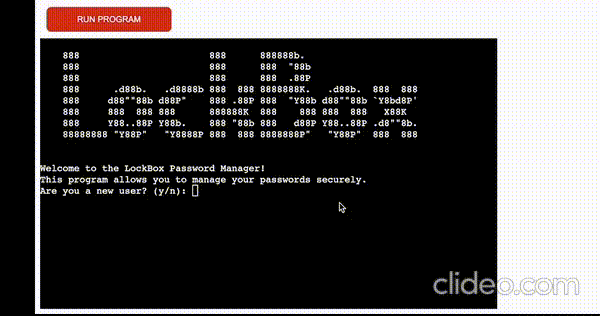

# LockBox

LockBox is an advanced password management application built to securely store and organize your sensitive information. With its user-friendly command-line interface, LockBox ensures convenient access to your passwords while employing robust encryption algorithms to safeguard your data from unauthorized access. The application allows you to generate strong and unique passwords, eliminating the need to remember complex combinations. By adhering to best security practices, LockBox provides a secure environment for managing your passwords, ensuring the protection of your online accounts. Experience the convenience and peace of mind that LockBox brings, offering a reliable and efficient solution for your password management needs.

# How to use

1.  Existing User Login: If you are an existing user, you will be prompted to enter your username. After entering your username, you will be asked to provide your master password. Enter your master password without displaying the input. If the entered master password matches the stored master password, you will be logged in successfully.

2.  New User Account Creation: If you are a new user, you will be asked to create a new account. Enter your desired username and create a master password. Confirm the master password to ensure accuracy. The application will create a new account and store your master password securely.

3.  Main Menu: After logging in or creating a new account, you will be presented with the main menu. The main menu allows you to perform various actions:

- Display Passwords (Option 1): Choose this option to display all the stored passwords associated with your account. If there are no passwords stored, a message will be displayed indicating that there are no passwords stored for your account.

- Add Password (Option 2): Use this option to add a new password for an account. You will be prompted to enter the site or account name and choose an option to either enter the password manually or generate a random password. If you choose to enter the password manually, you need to follow the password requirements (minimum length of 4 characters and at least 1 special character). If you choose to generate a random password, you can specify the length or use the default length of 12 characters. The password will be added to your account's stored passwords.

- Remove Password (Option 3): Select this option to remove a password from your account. You will be prompted to enter the account name associated with the password you want to remove. If the account exists in your stored passwords, it will be removed.

- Quit (Option 4): Choose this option to exit the application. It will terminate the program and display a goodbye message.

4.  Menu Navigation: While in the main menu, you can choose the desired option by entering the corresponding number (1-4) and pressing Enter. If you enter an invalid choice, an error message will be displayed, and you can try again.

# Target Audience

## User Stories

1.  New User:

- As a new user, I want to create a secure account with a unique username and master password. I want to be guided through the process of setting up my account and master password, ensuring that my password meets the required criteria. Once my account is set up, I want to be able to add and manage my passwords easily.

2. Returning User:

- As a returning user, I want to be able to log in to my existing account using my username and master password. I expect the application to validate my credentials and provide access to my stored passwords securely. I want to be able to view and manage my passwords, including adding new passwords, removing outdated ones, and updating existing ones.

3. Frequent User:

- As a frequent user, I rely on LockBox to securely store and manage my passwords. I value its quick login, organized display of passwords, and features like adding, removing, and updating passwords. The password generator adds extra security. LockBox streamlines password management and protects my sensitive information.

# Data Model

I have used a file-based data model provides a simple and portable approach to store and manage passwords.

- User Account: Each user has a unique username associated with their account. The username is used to identify the user and retrieve their stored passwords.
- Master Password: The user sets a master password during account creation. The master password is used to secure the user's account and protect access to their stored passwords.
- Stored Passwords: For each user account, there is a file that stores the associated passwords. The passwords are stored in a key-value format, where the account name acts as the key and the corresponding password is the value.

I also used termios and tty modules to manipulate the terminal so that I could display "\*" when the user types a password.

## Logic Map

# Features

## User Account Creation

- The application allows new users to create an account by providing a unique username and a master password. The master password is used to secure the account and protect access to the stored passwords.
  

## Login and Authentication

- Existing users can log in to their account by entering their username and master password. The application verifies the entered credentials to grant access to the stored passwords.

## Display Stored Passwords

- Once logged in, the user can view a list of their stored passwords. The application retrieves the passwords associated with the user's account and displays them, showing the account name and the corresponding password.

## Add New Password

- The user can add a new password to their account. They provide the account name and choose either to enter the password manually or generate a random password. If manually entered, the password is validated to meet certain criteria (e.g., minimum length and containing at least one special character). The new password is then stored securely in the user's account.

## Remove Password

- The user can remove a password from their account by specifying the account name. The application locates the corresponding password and removes it from the stored passwords.

## Master Password Update

- Users have the option to update their master password. They can choose to change their existing master password to enhance security. The application prompts them to enter the current master password for verification and then allows them to set a new master password.

## Encryption and Security

- The user's master password is securely stored using encryption techniques. This ensures that the master password cannot be easily accessed or compromised. Additionally, the application enforces certain password requirements and provides validation to enhance the security of stored passwords.

## Error Handling

- The application handles various error scenarios gracefully, such as invalid input, incorrect passwords, non-existing accounts, and file access errors. It provides informative error messages to guide users and ensure a smooth user experience.

## Menu-based Navigation

- The application presents users with a menu-based navigation system. Users can choose different options from the menu to perform specific actions, such as displaying passwords, adding passwords, removing passwords, updating the master password, and quitting the application.

## Features Left to Add

- Password Strength Checker
  - Improve the application by adding a password strength check feature.
- Password Generator Customization
  - Expand the password generator to allow the users to customize the generated passwords to their preferences.
- Two-Factor Authentication (2FA)
  - Add support for two-factor authentication as an additional layer of security for user accounts.

# Technologies Used

Python

# Frameworks, Libraries and Programs Used

Git - For version control.

Github - To save and share files for the site.

VScode - IDE used to code the site.

Cryptography - For encrypting and decrypting data.

[Cloud Convert](https://cloudconvert.com) - Converting videos to gif.

[Techsini](https://techsini.com) - For generating mockups.

[Clideo](https://clideo.com/resize-video) - For resizing screen recorded videos.

[Loom](https://www.loom.com) - For screen recording.

# Testing

## Validator Testing

- Python
  - No errors or warnings where returned when using the [Pep8ci Validator](https://pep8ci.herokuapp.com/#)

There are some lines of code that exceed the Pep8 recommended 79 character limit but, changing these lines will effect the functionality of the program. To make sure the Pep8 linter ignores the longer lines i have used # noqa.

## Solved Bugs

1.  When an exiting user logged in and tried to display their passwords, and error would occur "cryptography.fernet.InvalidToken" . The issue was with the decryption process of the stored passwords. Specifically encrypted data had an invalid signature.

- To solve the issue I added error handling for exceptions raised during encryption, decryption, and file operations.

2.  Then when running the program again and selection the option to display passwords the user received the following error "Invalid password data. Failed to decrypt."

- To solve this new issue I realized I had not added a function to generate an encryption key, once I added this and made sure that the encryption key was generated and used consistently, the program displayed the user passwords correctly.

3.  I was receiving an error when creating a new account and master password. This because I had forgotten to add the new key perimeter to multiple functions cause an error when running the program.

- To fix this I added the necessary key perimeter to the functions that where missing this.

4. When generating a random password the user is asked to input a password length, the user could put any number and the function would return "+0".

- To fix this I added a max password length of 14 characters. Now if a user inputs a password length over 14 the function generates a password with the max length of 14 characters.

5. When loading the program the user is prompted, asking if they are a new user y/n. If the user entered any key that was not "n" the system would proceed as if the user selected "y".

- To fix this I added validation so that if any keys other that "y/n" are entered the system alerts the user of an invalid input and asks the original prompt.

6. When a users was entering a password, if the "backspaced" the system would take this a s a key entry as part of the password.

- To fix this I added and elif statement to the get_user_password function, so that when backspace is pressed it minuses 1 character. I then added an sys.stdout.write to remove the the asterisk displayed on the screen.

## Bugs

No bugs found.

## Full Testing

# Deployment

## Local Development

# Credits

## Inspiration
